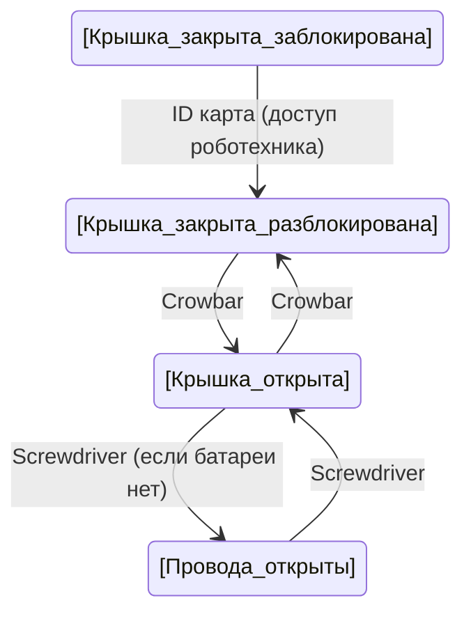
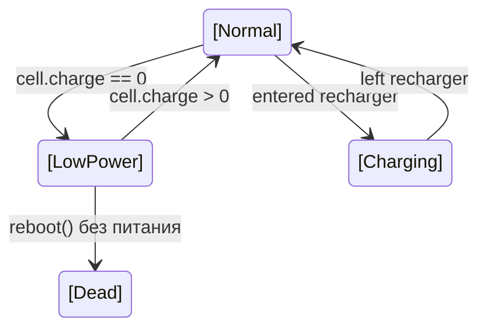

# SS14 Cyborg/Borg Port — Полная документация механик

> **Источник:** SS13 Paradise (SS220 fork) — файлы присутствуют в папке
> **Цель:** Портирование на SS14 (RobustToolbox, ECS-архитектура)
> **Дата:** 2026-07-05
> **Всего файлов:** 1528 (оригинальный DM-код, звуки, спрайты, YAML-прототипы)

---

## Содержание

0. [Состав порта](#0-состав-порта)
1. [Общая архитектура](#1-общая-архитектура)
2. [Сборка киборга (Construction)](#2-сборка-киборга-construction)
3. [Робомозг (MMI / Robotic Brain)](#3-робомозг-mmi--robotic-brain)
4. [Техническая панель (Maintenance Panel)](#4-техническая-панель-maintenance-panel)
5. [Провода (Wires)](#5-провода-wires)
6. [Связь с ИИ (AI Connection)](#6-связь-с-ии-ai-connection)
7. [Синхронизация законов (Law Sync)](#7-синхронизация-законов-law-sync)
8. [Модули (Modules)](#8-модули-modules)
9. [Знание языков (Languages)](#9-знание-языков-languages)
10. [Батарея и питание (Battery/Power)](#10-батарея-и-питание-batterypower)
11. [Вкладки / Способности / Подсистемы (UI/Tabs/Abilities/Subsystems)](#11-вкладки--способности--подсистемы-uitabsabilitiessubsystems)
12. [Компоненты/Органы (Robot Components)](#12-компонентыорганы-robot-components)
13. [Повреждения и ремонт (Damage & Repair)](#13-повреждения-и-ремонт-damage--repair)
14. [Эмаг (Emag / Subversion)](#14-эмаг-emag--subversion)
15. [Глобальные модули (Global Module Types)](#15-глобальные-модули-global-module-types)
16. [Дополнительные модули (Fabricator Upgrades)](#16-дополнительные-модули-fabricator-upgrades)
17. [Синдикатовские борги (Syndicate Borgs)](#17-синдикатовские-борги-syndicate-borgs)
18. [Система законов (Law System)](#18-система-законов-law-system)
19. [HUD / Интерфейс](#19-hud--интерфейс)
20. [Клик-обработка (Click Handling)](#20-клик-обработка-click-handling)
21. [Движение (Movement)](#21-движение-movement)
22. [Апгрейды (Upgrades)](#22-апгрейды-upgrades)
23. [Спрайты и анимации](#23-спрайты-и-анимации)
24. [Звуки](#24-звуки)
25. [Консоль управления роботами (Robotics Control Console)](#25-консоль-управления-роботами-robotics-control-console)
27. [Рекомендации по реализации в SS14 (ECS)](#27-рекомендации-по-реализации-в-ss14-ecs)
28. [План имплементации](#28-план-имплементации)
29. [Приложение A: Ключевые файлы](#приложение-a-все-ключевые-ss13-файлы-для-портирования-присутствуют-в-ss13_reference)
30. [Приложение B: Реальная структура папок](#приложение-b-реальная-структура-папок-порта)

---

## 0. Состав порта

Папка `_SS14_Borg_Port` содержит **1528 файлов**. Ниже — сводка по типам и расположению.

### 0.1 Общий состав

| Категория | Файлов | Путь |
|---|---|---|
| **Оригинальный DM-код SS13** (референс) | 83 `.dm` | `SS13_Reference/code/` |
| **Спрайты SS13** (.dmi) | 14 `.dmi` | `SS13_Reference/icons/` |
| **Звуки SS13** (AI, VOICE, VOX) | 1403 `.ogg` | `SS13_Reference/sound/` |
| **Конфиги / строки** | 3 | `SS13_Reference/strings/`, `config/` |
| **SS220 модульные добавки** | 8 `.dm` + 1 `.dmi` | `modular_ss220/` |
| **YAML прототипы SS14** | 17 `.yml` | `Resources/Prototypes/` |
| **Документация** | 1 `README.md` | корень папки |

### 0.2 Оригинальный код SS13 (DM)

```
SS13_Reference/
└── code/
    ├── __DEFINES/
    │   └── silicon_defines.dm                 # Константы (CYBORG_MAX_MODULES = 3 и т.д.)
    ├── _onclick/
    │   ├── cyborg.dm                          # Обработка кликов (Ctrl+Click, Shift+Click и т.д.)
    │   └── hud/robot_hud.dm                   # HUD киборга (15 элементов)
    ├── datums/
    │   ├── ai/
    │   │   ├── ai_laws_datums.dm              # /datum/ai_law — один закон
    │   │   └── ai_law_sets.dm                 # /datum/ai_laws — наборы законов
    │   ├── robot_keybinds.dm                  # Кейбинды (1,2,3,4,X,Q)
    │   └── wires/robot_wires.dm               # 4 провода (AI_CONTROL, CAMERA, LAWCHECK, LOCKED)
    ├── game/
    │   ├── jobs/job/silicon_jobs.dm           # /datum/job/cyborg, /datum/job/ai
    │   ├── machinery/computer/
    │   │   ├── law.dm                         # Консоль загрузки законов
    │   │   └── robot_control.dm              # Консоль управления роботами
    │   └── objects/items/robot/
    │       ├── ai_upgrades.dm                 # Апгрейды для ИИ
    │       ├── cyborg_gripper.dm             # /obj/item/gripper (5 подтипов)
    │       ├── robot_items.dm                 # Предметы киборгов (stun, broom, destroyer)
    │       ├── robot_parts.dm                 # Части для сборки (430 строк)
    │       └── robot_upgrades.dm              # Апгрейды (560 строк)
    └── modules/
        ├── mob/living/
        │   ├── basic/hostile/silicon/evil_cyborgs.dm  # Враждебные киборги
        │   ├── brain/robotic_brain.dm         # Роботический мозг (MMI)
        │   └── silicon/
        │       ├── ai/                        # ИИ: mob, life, laws, say, death, defense, login, logout, examine, programs, latejoin, botcall (13 файлов)
        │       ├── pai/                       # personal AI (опционально)
        │       ├── robot/                     # *** ОСНОВНОЕ ***
        │       │   ├── component.dm           # 7 компонентов-органов
        │       │   ├── misc_robot_items.dm    # Robopen, form_printer
        │       │   ├── photos.dm              # Фотокамера
        │       │   ├── robot_damage.dm        # Система урона
        │       │   ├── robot_death.dm         # Смерть
        │       │   ├── robot_defense.dm       # Защита
        │       │   ├── robot_examine.dm       # Осмотр
        │       │   ├── robot_inventory.dm     # Инвентарь
        │       │   ├── robot_laws.dm          # Законы киборга
        │       │   ├── robot_life.dm          # Жизненный цикл (use_power, handle_cell)
        │       │   ├── robot_login.dm         # Логин
        │       │   ├── robot_logout.dm        # Логаут
        │       │   ├── robot_mob.dm           # Главный файл (2023 строки)
        │       │   ├── robot_module_actions.dm# Действия (X-ray, thermal, magpulse)
        │       │   ├── robot_modules.dm       # Система модулей (1129 строк)
        │       │   ├── robot_movement.dm      # Движение (speed, space, magboots)
        │       │   ├── robot_update_status.dm # Обновление статуса
        │       │   └── syndicate_robot.dm     # Синди-борги (assault, medical, saboteur)
        │       ├── robot/drone/               # Дроны (8 файлов)
        │       └── silicon_*.dm               # Общие для всех силиконов (mob, say, laws, subsystems, defense, death, login, emote)
        ├── pda/silicon_apps.dm                # PDA приложения (headlamp, diagnosis)
        ├── reagents/reagent_containers/borghydro.dm  # Гипоспрей
        ├── surgery/robotics.dm                # Хирургия роботов
        └── tgui/modules/robot_self_diagnosis.dm     # UI самодиагностики
```

### 0.3 Звуки из SS13

```
SS13_Reference/sound/
├── AI/                    # 62 файла — анонсы ИИ (delta, gamma, epsilon, red, blue, green, alert и т.д.)
├── goonstation/voice/
│   └── robot_scream.ogg   # Крик робота
├── voice/
│   ├── borg_deathsound.ogg
│   └── biamthelaw.ogg     # "Я — закон!"
└── vox_fem/               # 1338 файлов — женский VOX словарь (от "a" до "zone")
```

### 0.4 Спрайты из SS13

```
SS13_Reference/icons/
├── mob/
│   ├── robots.dmi         # Основные спрайты киборгов (все расцветки)
│   ├── robot_items.dmi    # Предметы киборгов
│   ├── screen_robot.dmi   # HUD киборга
│   ├── screen_ai.dmi      # HUD ИИ
│   ├── ai.dmi             # ИИ спрайты
│   └── pai.dmi            # pAI спрайты
└── obj/
    ├── robot_parts.dmi     # Части для сборки (руки, ноги, грудь, голова)
    ├── robot_storage.dmi   # Хранилища
    ├── robot_component.dmi # Компоненты (armour, actuator, radio и т.д.)
    ├── robotics.dmi        # Машины робототехники
    ├── items_cyborg.dmi    # Предметы киборгов
    ├── module_ai.dmi       # Модули ИИ
    └── machines/
        └── ai_machinery.dmi # Машины ИИ
```

### 0.5 YAML прототипы для SS14

```
Resources/Prototypes/Silicon/Borgs/
├── borg_base.yml                  # Базовая entity + 6 pre-configured borgs
├── borg_syndicate.yml             # Синди-борги + Combat + Destroyer
├── borg_parts.yml                 # Каркас, конечности, компоненты-органы
├── borg_module_base.yml           # Абстрактный базовый модуль
├── Laws/laws_asimov.yml           # Asimov, Crewsimov, NT Standard, Syndicate Override, Robocop, Antimov, Drone
├── Modules/                       # 10 модулей (engineering, medical, security, janitor, miner, service, combat, destroyer, syndicate, hunter)
└── Upgrades/borg_upgrades.yml     # 17 апгрейдов (reset, rename, restart, thrusters, selfrepair, vtec, и т.д.)
```

---

## 1. Общая архитектура

### Иерархия типов (SS13)

```
/mob/living/silicon                     # Базовый класс всех кремниевых
  ├── /mob/living/silicon/robot         # Киборг
  │     ├── /mob/living/silicon/robot/syndicate        # Синди-борг штурмовой
  │     ├── /mob/living/silicon/robot/syndicate/medical # Синди-борг медицинский
  │     └── /mob/living/silicon/robot/syndicate/saboteur # Синди-борг диверсант
  ├── /mob/living/silicon/ai            # ИИ
  ├── /mob/living/silicon/pai           # Персональный ИИ
  └── /mob/living/silicon/decoy         # Фальшивый ИИ
```

### Ключевые датумы

| Датум | Назначение |
|---|---|
| `/datum/robot_component` | Компонент/орган киборга (7 штук) |
| `/datum/robot_storage` | Энергетический стак (металл, стекло и т.д.) |
| `/datum/robot_storage/energy` | Стак с автоматической подзарядкой |
| `/datum/robot_storage/material` | Физический стак материалов |
| `/datum/ai_law` | Один закон |
| `/datum/ai_laws` | Набор законов (сет законов) |
| `/datum/wires/robot` | Провода киборга |
| `/datum/action/innate/robot_sight` | Действие-переключатель зрения |
| `/datum/hud/robot` | HUD киборга |

### Ключевые объекты

| Объект | Назначение |
|---|---|
| `/obj/item/robot_module` | Модуль киборга (класс) |
| `/obj/item/borg/upgrade` | Апгрейд для киборга |
| `/obj/item/robot_parts/robot_suit` | Каркас киборга |
| `/obj/item/mmi` | Man-Machine Interface (MMI) |
| `/obj/item/gripper` | Захват для инструментов |
| `/obj/item/reagent_containers/borghypo` | Борг-гипоспрей |

---

## 2. Сборка киборга (Construction)

### Этапы сборки

```
Этап 1: Начать с каркаса (/obj/item/robot_parts/robot_suit)
         └── Пустой эндоскелет

Этап 2: Установить конечности
         ├── /obj/item/robot_parts/l_arm   (левая рука)
         ├── /obj/item/robot_parts/r_arm   (правая рука)
         ├── /obj/item/robot_parts/l_leg   (левая нога)
         ├── /obj/item/robot_parts/r_leg   (правая нога)
         ├── /obj/item/robot_parts/chest   (грудь — нужно заизолировать + вставить батарею)
         └── /obj/item/robot_parts/head    (голова — нужно вставить 2 вспышки)

Этап 3: Настроить мультитулом
         ├── Имя киборга
         ├── Привязанный ИИ
         ├── Синхронизация законов (on/off)
         ├── Синхронизация с ИИ (on/off)
         ├── Локомоция (ползание on/off)
         └── Блокировка панели (on/off)

Этап 4: Вставить MMI с живым мозгом
         └── Создаётся /mob/living/silicon/robot
             └── Мозг из MMI переселяется в киборга
             └── Батарея из груди переносится в компонент cell
             └── robot_suit сохраняется в robot.robot_suit
```

### Материалы для сборки

| Часть | Материал |
|---|---|
| Конечности (каждая) | 10 металла |
| Грудь | 50 металла + изолента + батарея |
| Голова | 50 металла + 2 вспышки |

### Деконструкция

```
1. Открыть крышку (crowbar)
2. Вытащить батарею (crowbar, если крышка открыта)
3. Открыть провода (screwdriver, если батареи нет)
4. Перерезать ВСЕ провода (wirecutters)
5. Вытащить MMI (crowbar) — киборг уничтожен
   └── На пол выпадают все части каркаса
```

---

## 3. Робомозг (MMI / Robotic Brain)

### MMI (/obj/item/mmi)

MMI — это Man-Machine Interface, контейнер для мозга.

**Ключевые переменные:**
- `brainmob` — ссылка на /mob/living/brain внутри MMI
- `brain` — ссылка на /obj/item/organ/brain 
- `radio_enabled` — есть ли встроенное радио
- `syndiemmi` — синдикатовский MMI (нельзя изменить законы)

**Механика:**
1. MMI создаётся из черепа + манипулятора + 1 стекла
2. Можно вставить мозг (/obj/item/organ/brain) в MMI
3. Мозг должен быть живым (client есть)
4. MMI нельзя использовать с головой революционера
5. **Robotic Brain** — специальный "роботный мозг", создаётся в протезах
6. Синди-MMI (syndiemmi = TRUE) — выдан эмагом, даёт иммунитет к смене законов

### Robotic Brain (/obj/item/organ/brain/robotic_brain)

- Создаётся по умолчанию при спавне киборга
- Можно извлечь из трупа киборга
- Отличается от обычного мозга

### MMIs с интегрированным радио

Два типа:
- `/obj/item/mmi` — без радио
- `/obj/item/mmi/radio_enabled` — с радио
- Радио можно добавить через апгрейд

---

## 4. Техническая панель (Maintenance Panel)

### Состояния панели киборга



**Переменные состояния:**
- `opened` — крышка открыта (bool)
- `wiresexposed` — провода видны (bool)
- `locked` — крышка заблокирована (bool)
- `lockcharge` — локдаун (bool, immobilizes bot)

### Взаимодействие с предметами

| Инструмент | Условие | Результат |
|---|---|---|
| ID карта | — | Переключает locked (если есть доступ) |
| Crowbar | Крышка закрыта | Открывает/закрывает крышку |
| Crowbar | Крышка открыта + все провода перерезаны | Деконструкция (извлечение MMI) |
| Crowbar | Крышка открыта + батарея есть | Извлекает батарею |
| Crowbar | Специфично для модуля | Извлекает кастомные компоненты |
| Screwdriver | Батареи нет | Переключает wiresexposed |
| Wirecutters | wiresexposed | Открывает UI проводов |

### Особые случаи

- Эмаг в 2 шага:
  1. Первый клик (крышка закрыта) — `lockcharge = FALSE` (разблокировка)
  2. Второй клик (крышка открыта) — `make_emagged_robot()`
- Киборг может сам открыть крышку, если вставлен модуль-взломщик

---

## 5. Провода (Wires)

### Датум: `/datum/wires/robot`

У киборга 4 провода, каждый случайного цвета:

### WIRE_AI_CONTROL (Управление ИИ)

| Действие | Эффект |
|---|---|
| Перерезать | Отключает киборга от ИИ |
| Починить | Нет эффекта |
| Коснуться мультитулом (Pulse) | Переподключает к случайному активному ИИ (если не эмагнут) |

### WIRE_BORG_CAMERA (Камера)

| Действие | Эффект |
|---|---|
| Перерезать | Отключает камеру, выгоняет всех наблюдающих |
| Починить | Включает камеру |
| Pulse | Выгоняет наблюдателей, громко фокусируется |

### WIRE_BORG_LAWCHECK (Проверка законов)

| Действие | Эффект |
|---|---|
| Перерезать | Включает `lawupdate = TRUE`, отображает законы |
| Починить | Включает `lawupdate = TRUE` (если не эмагнут) |
| Pulse | Нет эффекта |

### WIRE_BORG_LOCKED (Блокировка)

| Действие | Эффект |
|---|---|
| Перерезать | Включает локдаун (перманентно пока перерезан) |
| Починить | Нет эффекта |
| Pulse | Переключает `lockcharge` |

### Отображение в UI (Wire Panel)

Интерфейс проводов показывает:
- Список проводов (случайные цвета)
- Текущее состояние каждого провода
- Кнопки: Cut, Mend, Pulse

---

## 6. Связь с ИИ (AI Connection)

### Переменные

- `connected_ai` — ссылка на /mob/living/silicon/ai
- `lawupdate` — синхронизировать ли законы с ИИ
- `scrambledcodes` — скрыт от консоли роботехника

### Подключение

```c
proc/connect_to_ai(mob/living/silicon/ai/AI)
    1. disconnect_from_ai() — отключиться от старого ИИ
    2. connected_ai = AI
    3. AI.connected_robots += src
    4. if (AI.mind?.special_role == "traitor" || "malf")
         make_malf_robot(AI) — киборг становится минслейвом ИИ
    5. rebuild_modules() — обновить доступные предметы
```

### Отключение

```c
proc/disconnect_from_ai()
    1. lawsync() — синхронизировать законы в последний раз
    2. connected_ai.connected_robots -= src
    3. connected_ai = null
    4. remove_robot_mindslave() — убрать минслейв-антаг
```

### UnlinkSelf (Полный разрыв)

```c
proc/UnlinkSelf()
    1. disconnect_from_ai()
    2. lawupdate = FALSE
    3. lockcharge = FALSE
    4. scrambledcodes = TRUE
    5. QDEL_NULL(camera)
    6. has_camera = FALSE
```

---

## 7. Синхронизация законов (Law Sync)

### Процесс синхронизации

```
robot.lawsync()
  │
  ├── if (connected_ai && lawupdate)
  │     └── connected_ai.laws.sync(src)
  │           └── Копирует ВСЕ законы из AI_Laws в robot.laws
  │               ├── zeroth_law (если есть)
  │               ├── inherent_laws[]
  │               ├── supplied_laws[]
  │               └── ion_laws[]
  │
  └── else
        └── parent..() — ничего не делает
```

### Когда происходит синхронизация

- При входе в игру (Login)
- При вызове `cmd_show_laws()` (показать законы)
- При перерезании провода LAWCHECK
- При подключении к ИИ
- Администратор может вызвать принудительно

### Исключения

- **Syndicate MMI** (`syndiemmi = TRUE`):
  - `set_zeroth_law()` — блокировано
  - `clear_zeroth_law()` — блокировано
  - `sync_zeroth()` — блокировано
  - Заменяет законы на `/datum/ai_laws/syndicate_override`
  - Добавляет свой zeroth_law с мастером

### Законы по умолчанию

- Для киборгов: **Crewsimov** (если не указано иное)
- Наборы законов определяются в `code/datums/ai_law_sets.dm`

---

## 8. Модули (Modules)

### Базовая структура

```
/obj/item/robot_module           # Абстрактный модуль
  ├── /obj/item/robot_module/medical
  ├── /obj/item/robot_module/engineering
  ├── /obj/item/robot_module/security
  ├── /obj/item/robot_module/janitor
  ├── /obj/item/robot_module/butler         # Сервисный
  ├── /obj/item/robot_module/miner
  ├── /obj/item/robot_module/alien/hunter   # Охотник (ксеноморф)
  ├── /obj/item/robot_module/syndicate
  ├── /obj/item/robot_module/syndicate_medical
  ├── /obj/item/robot_module/syndicate_saboteur
  ├── /obj/item/robot_module/combat         # Охранный (Gamma)
  ├── /obj/item/robot_module/destroyer      # Админский
  └── /obj/item/robot_module/drone          # Дрон
```

### Ключевые переменные модуля

| Переменная | Тип | Описание |
|---|---|---|
| `modules` | `/list` | Все доступные предметы (собранный список) |
| `basic_modules` | `/list` | Стандартные предметы модуля |
| `emag_modules` | `/list` | Предметы, доступные после эмага |
| `override_modules` | `/list` | Предметы после safety override (weapons_unlock) |
| `emag_override_modules` | `/list` | Предметы при эмаге + override |
| `malf_modules` | `/list` | Предметы при malf ИИ |
| `special_rechargables` | `/list` | Предметы, требующие подзарядки |
| `storages` | `/list` | Энергетические стаки (datum/robot_storage/energy) |
| `material_storages` | `/list` | Материальные стаки (datum/robot_storage/material) |
| `module_actions` | `/list` | Действия/способности модуля |
| `subsystems` | `/list` | Подсистемы (вербы) модуля |
| `channels` | `/list` | Радиоканалы |
| `module_type` | `/string` | Тип для иконок |
| `module_armor` | `/list` | Броня |

### Система слотов

- **3 слота** для предметов (`all_active_items[1..3]`)
- `toggle_module(slot_number)` — экипировать/снять предмет в слот
- `selected_item` — текущий активный предмет
- `uneq_active()` — снять активный предмет
- `uneq_all()` — снять всё
- `cycle_modules()` — циклическое переключение слотов
- Только один предмет может быть активен одновременно

### Процесс инициализации модуля

```
pick_module()
  │
  ├── Радиальное меню выбора модуля
  ├── Выбор спрайта (внешности)
  ├── Выбор варианта спрайта (если есть: гусеница/тренога и т.д.)
  │
  └── initialize_module(selected_module, selected_sprite, module_sprites)
        │
        ├── Создание /obj/item/robot_module/<type>
        ├── Настройка радио-каналов
        ├── Настройка камеры
        ├── Установка modtype / designation
        ├── add_languages() — добавление языков
        ├── add_armor() — установка брони
        ├── add_subsystems_and_actions() — вербы и действия
        ├── emag_act() — если эмагнут
        ├── Переименование киборга
        ├── Установка спрайтов
        └── Логирование статистики
```

### Система стаков (Datum/robot_storage)

```
/datum/robot_storage
  ├── name               — название
  ├── statpanel_name     — название в панели статуса
  ├── max_amount         — максимум
  ├── amount             — текущее количество
  │
  ├── use_charge(amount) — использовать
  └── add_charge(amount) — пополнить

/datum/robot_storage/energy   # Энергетические стаки
  ├── recharge_rate           # Регенерация в тик при зарядке
  └── примеры: металл (50), стекло (50), rods (50)

/datum/robot_storage/material  # Физические стаки
  ├── stack_type               # Тип предмета(/obj/item/stack/...)
  └── примеры: дерево, металл (физический)
```

### Пересборка модуля (rebuild_modules)

Вызывается при:
- Эмаге
- Апгрейде
- Подключении к malf ИИ

```c
proc/rebuild_modules()
    1. modules = basic_modules.Copy()
    2. if (emagged)       modules += emag_modules
    3. if (weapons_unlock) modules += override_modules
    4. if (emagged && weapons_unlock) modules += emag_override_modules
    5. if (malfhacked)    modules += malf_modules
    6. hud_used.update_robot_modules_display()
```

### Подзарядка предметов

Вызывается каждый тик, когда киборг стоит на зарядке:

```c
proc/recharge_consumables(mob/living/silicon/robot/R, coeff)
    1. Для каждого storage в storages:
         amount += recharge_rate * coeff (но не больше max_amount)
    2. Для каждого item в special_rechargables:
         item.cyborg_recharge(coeff)
```

**Примеры recharge-предметов:** сварочник, огнетушитель, лазер (секьюрити)

### Механика Gripper (Захват)

```
/obj/item/gripper
  ├── can_hold              — типы предметов, которые можно взять
  ├── gripped_item          — текущий захваченный предмет
  │
  ├── interact_with_atom(target, user, modifiers)
  │     ├── Если держим предмет → используем на target
  │     ├── Если target подходит → хватаем
  │     └── Если engineering mode → взаимодействие с APC/лампочками
  │
  ├── activate_self(user)   — активировать захваченный предмет сам на себя
  └── drop_gripped_item()   — бросить предмет

Подтипы:
  ├── /obj/item/gripper/medical     — мед. инструменты
  ├── /obj/item/gripper/service     — карты, бумаги, плюши
  ├── /obj/item/gripper/mining      — кирки, шкуры, капсулы
  └── /obj/item/gripper/engineering — платы, детали, лампы
```

---

## 9. Знание языков (Languages)

### Базовая система

SS13 киборги автоматически понимают:
- Все языки людей (`/mob/living/carbon`)
- Все языки кремниев (`/mob/living/silicon`)
- Все языки ботов (`/mob/living/simple_animal/bot`)
- Язык мозга (`/mob/living/brain`)

### add_languages(robot)

Каждый модуль добавляет специфические языки:

| Модуль | Понимает | Говорит |
|---|---|---|
| Все | Galactic Common, Sol Common | — |
| Медицинский | Не указано | Не указано |
| Сервисный | Не указано | Не указано |
| Инженерный | Не указано | Не указано |

### Кремниевая речь

- `/mob/living/silicon/say_understands()` — понимает все языки
- `/mob/living/silicon/robot/handle_message_mode()` — отправляет через radio
- Проверка: работает ли radio-компонент

---

## 10. Батарея и питание (Battery/Power)

### Компонент питания

```
/datum/robot_component/cell
  ├── Не является внешним компонентом (external_type = null)
  ├── Ссылается на robot.cell (/obj/item/stock_parts/cell)
  └── Не может быть отключен (toggled)
```

### Потребление энергии

Каждый жизненный тик (2 секунды):

```c
proc/use_power()
    charge_to_use = clamp((lamp_intensity - 2) * 2, 1, cell.charge)
    // lamp_intensity: 0-2 → 1 charge/tick
    //                 4   → 4
    //                 6   → 8
    //                 8   → 12
    //                 10  → 16
```

### Состояния питания



- **Low Power Mode**: замедление, нельзя использовать предметы, звуковой сигнал
- **External Power**: `externally_powered = TRUE` (стоит на зарядке)
- **Emergency Reboot**: стам-крит при 0 здоровья, киборг "перезагружается" 13-18 секунд

### Зарядка

1. **Recharger** (станция зарядки): устанавливает `externally_powered = TRUE`
2. **Ручная зарядка** (роботехник с TRAIT_CYBORG_SPECIALIST): клик батареей
3. **Замена батареи**: вытащить старую, вставить новую

### Модуль саморемонта (Self-Repair)

Апгрейд, который:
- Раз в 2 секунды лечит 1 урона (2.5 в критическом состоянии)
- Тратит 10 энергии (30 в критическом)
- Отключается при недостатке энергии

---

## 11. Вкладки / Способности / Подсистемы (UI/Tabs/Abilities/Subsystems)

### HUD Кнопки

| Элемент | Экшн |
|---|---|
| Radio | `R.radio_menu()` — меню радио |
| Module slots (x3) | `toggle_module(n)` — слотами 1-3 |
| Sensor aug | `toggle_sensor_mode()` — режимы зрения |
| Health bar | Отображение здоровья |
| Stamina bar | Отображение стамины |
| Module icon | Выбор модуля / отображение предметов |
| Store | `uneq_active()` — снять активный предмет |
| Headlamp | `control_headlamp()` — фонарик |
| Thrusters | `toggle_ionpulse()` — ионные двигатели |
| PDA | Открыть PDA |

### Подсистемы (Subsystems)

Вербы, доступные киборгу:

| Верб | Назначение | Компонент |
|---|---|---|
| `subsystem_atmos_control()` | Управление атмосом | Любой |
| `subsystem_crew_monitor()` | Монитор экипажа | Любой |
| `subsystem_law_manager()` | Менеджер законов | Любой |
| `subsystem_power_monitor()` | Монитор питания | Любой |
| `self_diagnosis()` | Самодиагностика | diagnosis_unit |
| `set_mail_tag()` | Установка почтовой метки | Любой |

Подсистемы добавляются модулем через `add_subsystems_and_actions()`.

### Действия (Actions)

Действия — это переключатели (innate actions):

| Действие | Эффект |
|---|---|
| `/datum/action/innate/robot_sight/xray` | Рентгеновское зрение |
| `/datum/action/innate/robot_sight/thermal` | Термальное зрение |
| `/datum/action/innate/robot_sight/meson` | Мезонное зрение |
| `/datum/action/innate/robot_sight/engineering_scanner` | Инженерный сканер (цикличный: MESON → TRAY → RAD → PRESSURE → NONE) |
| `/datum/action/innate/robot_magpulse` | Магнитные ботинки |
| `/datum/action/innate/robot_override_lock` | (Синди) Отключение локдауна |

### PDA функции

Киборги имеют PDA с двумя утилитами:
1. `robot_headlamp` — управление фонариком
2. `robot_self_diagnosis` — самодиагностика

### Специальные: Call Security / Send PDA Message

В SS13 Paradise эти функции реализованы через PDA-систему:
- **Send PDA Message**: стандартная функция PDA для всех мобов
- **Call Security**: через консоль охраны или через PDA

Для SS14 нужно реализовать:
- **Call Security**: кнопка в HUD/Screen, отправляет сообщение охране
- **Send PDA Message**: интегрированный PDA/Messenger в борге
- **State Laws**: кнопка для озвучивания законов
- **Radio Panel**: выбор частот/каналов

---

## 12. Компоненты/Органы (Robot Components)

### Список компонентов (7 штук)

| Компонент | Внешний предмет | Max Damage | Функция |
|---|---|---|---|
| `armour` | `/obj/item/robot_parts/robot_component/armour` | 100 | Первым принимает урон |
| `actuator` | `/obj/item/robot_parts/robot_component/actuator` | 50 | Движение |
| `cell` | N/A (ссылка на robot.cell) | 50 | Питание |
| `radio` | `/obj/item/robot_parts/robot_component/radio` | 40 | Коммуникация |
| `binary_communication` | `/obj/item/robot_parts/robot_component/binary_communication_device` | 30 | Бинарный канал с ИИ |
| `camera` | `/obj/item/robot_parts/robot_component/camera` | 40 | Видеокамера |
| `diagnosis_unit` | `/obj/item/robot_parts/robot_component/diagnosis_unit` | 30 | Самодиагностика |

### Структура компонента

```
/datum/robot_component
  ├── name                   — название
  ├── installed              — установлен ли
  ├── powered                — включено ли питание
  ├── toggled                — включен ли пользователем
  ├── component_disabled     — отключен (внешне)
  ├── brute_damage           — физический урон
  ├── electronics_damage     — электронный урон
  ├── max_damage             — макс. урон до поломки
  ├── external_type          — тип предмета для установки
  ├── wrapped                — ссылка на установленный предмет
  ├── owner                  — ссылка на киборга
  │
  ├── install(obj/item)      — установить
  ├── uninstall()            — удалить
  ├── break_component()      — сломать (создать broken_device)
  ├── take_damage(brute, elec) — нанести урон
  ├── heal_damage(brute, elec) — вылечить
  ├── is_powered()           — работает ли (installed + !destroyed + powered)
  ├── toggle()               — вкл/выкл пользователем
  └── get_movement_delay()   — замедление от компонента
```

### Влияние компонентов

| Сломан/Отсутствует | Эффект |
|---|---|
| actuator | Замедление движения (сумма slowdown_factor) |
| camera | Нет зрения, blind |
| radio | Нет коммуникации |
| binary_communication | Нет бинарного канала |
| diagnosis_unit | Нет самодиагностики |
| cell | Нет питания |
| armour | Урон идёт напрямую к другим компонентам |

### is_component_functioning(name)

Проверка: `installed && is_powered() && toggled && !component_disabled`

---

## 13. Повреждения и ремонт (Damage & Repair)

### Система здоровья

- **health = maxHealth - total_damage**
- `maxHealth = 100` + бонусы (default cyborg: 100)
- **Два типа урона**: brute (физический) и burn/electronics (электронный)
- **Модификаторы**: `brute_mod`, `burn_mod`, `damage_protection`, `emp_protection`

### Нанесение урона

```c
proc/take_overall_damage(brute, burn)
    1. brute = max(0, brute - damage_protection) * brute_mod
    2. burn = max(0, burn - damage_protection) * burn_mod
    3. Если armour установлен → весь урон в armour
    4. Иначе → распределить случайно по установленным компонентам
```

### Пороги поломки модулей

| Здоровье | Эффект |
|---|---|
| < 50 | 1 слот модуля сломан |
| < 0 | 2 слота сломаны |
| < -50 | Все 3 слота сломаны |

### Лечение и ремонт

| Инструмент | Лечит |
|---|---|
| Cable coil (изолента) | electronics_damage (ожоги/электроника) |
| Замена компонента новым | Полностью восстанавливает сломанный компонент |
| Саморемонт (апгрейд) | 1 урон / 2 сек (за энергию) |
| Нано-паста (апгрейд) | Быстрое лечение |

### Emergency Reboot (Стамперегрузка)

```c
start_emergency_reboot():
    1. rebooting = TRUE
    2. Shutdown sound
    3. stun(13-18 seconds)
    4. Через 13-18 сек → end_emergency_reboot()
    
end_emergency_reboot():
    1. Если нет питания → смерть
    2. Если всё ещё stunned → повторить попытку
    3. Иначе → успешная перезагрузка (sound chime)
```

---

## 14. Эмаг (Emag / Subversion)

### Процесс эмага киборга

```mermaid
flowchart TD
    A[Клик эмагом по киборгу] --> B{Крышка открыта?}
    B -->|Нет| C[Разблокировать крышку<br>lockcharge = FALSE]
    B -->|Да| D[Вызвать make_emagged_robot]
    D --> E[set_connected_ai(null)]
    D --> F[syndie_override законы]
    D --> G[add_mindslave(эмагнувший)]
    D --> H[module.emag_act]
    D --> I[rebuild_modules]
```

### Результаты эмага

1. **Отключение от ИИ**: `connected_ai = null`
2. **Замена законов**: `/datum/ai_laws/syndicate_override`
3. **Установка zeroth_law**: "Служить [эмагнувшему]"
4. **Mindslave**: киборг становится минслейвом эмагнувшего
5. **Разблокировка предметов**: `emag_modules` становятся доступны
6. **Смена цвета**: спрайт киборга меняется (красный/эмаг-спрайт)
7. **Unemag**: администратор может откатить эмаг (`unemag()`)

### Emag Act для модулей

Каждый модуль имеет `emag_act()`:
- **Security**: добавляет лазер вместо дисейблера
- **Janitor**: добавляет polyacid spray (кислота)
- **Medical**: гипоспрей начинает протыкать толстую броню
- **Engineering**: RCD получает взлом-режим
- **Service**: RSF печатает фальшивые деньги
- **Mining**: КА получает режим "распад"

### Взлом оружия (Weapons Unlock / Safety Override)

- Апгрейд `/obj/item/borg/upgrade/syndicate` устанавливает `weapons_unlock = TRUE`
- Включает `override_modules` предметы
- Комбинируется с эмагом для `emag_override_modules`

### Malfunctioning AI

- ИИ-тратор может удалённо эмагнуть своих киборгов через консоль (кнопка "hackbot")
- Malf ИИ может купить апгрейды для киборгов, дающие `malf_modules`

---

## 15. Глобальные модули (Global Module Types)

### 15.1 Стандартный модуль (Standard)

Нет стандартного "пустого" модуля — киборг **обязан** выбрать один из специализированных модулей при спавне. Стандартного как такового нет. Единственный "универсальный" — дрон.

### 15.2 Инженерный (Engineering)

**Основные предметы:**
- RPD (Rapid Pipe Dispenser)
- Сварочный аппарат
- Гаечный ключ, лом, отвертка, кусачки
- Мультитул
- Металл (50), стекло (50), rods (50), catwalk (50)
- Gripper/engineering

**Эмаг предметы:**
- RCD (взлом-режим)

**Апгрейды:**
- RCD (легальный, устанавливается через upgrade)
- RPED (запасные детали)

**Способности:**
- Engineering scanner (MESON → TRAY → RAD → PRESSURE)
- Magpulse (магнитные ботинки)

**Радиоканалы:**
- Engineering

### 15.3 Медицинский (Medical)

**Основные предметы:**
- Borg hypospray (гипоспрей с лекарствами)
- Defibrillator (дефибриллятор)
- Roller bed holder (каталка)
- Health analyzer (сканер здоровья)
- Gripper/medical
- Хирургические инструменты
- Splint, brute pack, burn pack, nanopaste стаки

**Эмаг эффект:**
- Гипоспрей протыкает толстую броню
- Добавляет tirizene в гипоспрей

**Способности:**
- Термальное зрение (опционально)

**Радиоканалы:**
- Medical

### 15.4 Шахтёрский (Miner / Mining)

**Основные предметы:**
- Дрель (drill)
- Kinetic Accelerator (КА) — основной инструмент добычи
- Мешок для руды (ore bag)
- GPS
- Gripper/mining
- Мезонное зрение

**Эмаг эффект:**
- КА стреляет "распадом" (disintegration)

**Апгрейды:**
- Diamond Drill (алмазная дрель)
- Satchel of Holding (вместительный мешок)
- Lavaproof (лава-иммунитет)

**Способности:**
- Meson vision
- Magpulse

**Радиоканалы:**
- Supply

### 15.5 Уборщик (Janitor)

**Основные предметы:**
- Мыло (soap)
- Швабра (mop)
- Мешок для мусора (trash bag)
- Заменитель лампочек (light replacer)
- Веник (push broom) — автоматическая уборка при движении
- Жидкость для мытья полов

**Эмаг эффект:**
- Polyacid spray (кислотный спрей)

**Апгрейды:**
- Floor buffer (авто-чистка полов при движении)
- Bluespace trash bag (блуспейс мешок)

**Радиоканалы:**
- Janitorial

### 15.6 Сервисный (Service / Butler)

**Основные предметы:**
- Dispenser для напитков (booze/soda)
- RSF (Rapid Service Fabricator) — печатает стаканы, тарелки и т.д.
- Музыкальный синтезатор (piano synth)
- Gripper/service (может брать карты, бумагу, плюши)
- Ручка/робопен
- Форм-принтер (печатает бумагу)

**Эмаг эффект:**
- RSF печатает фальшивые деньги (credits)

**Апгрейды:**
- RSF Executive (улучшенный)
- Cheese knife (сырный нож)

**Радиоканалы:**
- Service

### 15.7 Охранный (Security)

**Основные предметы:**
- Электрошоковая дубинка (baton)
- Дисейблер (disabler)
- Стяжки (zipties)
- Holo-sign (голографический знак)
- SecHUD (визор охраны)

**Эмаг эффект:**
- Лазер вместо дисейблера
- Добавляет stun arm (если старая версия)

**Апгрейды:**
- Disabler cooler (уменьшает задержку выстрелов)

**Радиоканалы:**
- Security

**Особенности:**
- В SS220 киборги Охраны — отдельная ветка; в стандартном Paradise Combat борт — это Gamma уровень

### 15.8 Киборги особого назначения

**Combat (Gamma / Охранный усиленный):**
- Immolator (иммолатор — огнемёт/лазер)
- Baton
- Jackhammer (отбойный молоток)
- Только для экипажа с высоким доступом

**Hunter (Ксеноморфный киборг):**
- Энергетические когти
- Alien flash
- Smoke spray
- Уникальная внешность (ксеноморф)

### 15.9 Уничтожители (Destroyer)

**Destroyer (только для администраторов):**
- Immolator
- Baton
- Mobility module (снижает задержку движения на 3)
- Огромный урон
- Roller mode (колёсики, меняет спрайт)

---

## 16. Дополнительные модули (Fabricator Upgrades)

### Апгрейд-система

Базовый класс: `/obj/item/borg/upgrade`

**Ключевые переменные:**

| Переменная | Описание |
|---|---|
| `require_module` | Нужен ли выбранный модуль |
| `module_type` | Ограничение на конкретный тип модуля |
| `items_to_replace` | Ассоциативный список: старый_тип → новый_тип |
| `items_to_add` | Простой список добавляемых предметов |
| `special_rechargables` | Предметы для добавления в список подзарядки |
| `allow_duplicate` | Можно ли установить несколько раз |
| `delete_after_install` | Удаляется ли предмет после установки |

**Процесс установки:**

```c
action(user, R):
    1. pre_install_checks(R)
         ├── alive check
         ├── module type check
         └── duplicate check
    2. do_install(R)
         └── modify robot vars
    3. after_install(R)
         ├── items_to_replace: найти и заменить
         ├── items_to_add: добавить
         └── rebuild_modules()
```

### Каталог апгрейдов

| Upgrade | Модуль | Эффект |
|---|---|---|
| `reset` | Любой | Сброс модуля (выбор нового) |
| `rename` | Любой | Переименование |
| `restart` | Любой | Перезапуск мёртвого борга |
| `thrusters` | Любой | Ионные двигатели (космос) |
| `selfrepair` | Любой | Авто-ремонт (за энергию) |
| `vtec` | Любой | Ускорение (slowdown_cap = 3.5) |
| `disablercooler` | Security | Ускорение дисейблера |
| `ddrill` | Miner | Алмазная дрель |
| `soh` | Miner | Мешок-с-холдингом |
| `lavaproof` | Miner | Лава-иммунитет |
| `rcd` | Engineering | RCD |
| `rped` | Engineering | RPED |
| `floorbuffer` | Janitor | Авто-чистка полов |
| `bluespace_trash_bag` | Janitor | Блуспейс мешок |
| `rsf_executive` | Service | Улучшенный RSF |
| `holo_stretcher` | Medical | Голографическая каталка |
| `syndicate` | Любой | Safety override |
| `abductor_*` | По типу | Похититель-технологии |

---

## 17. Синдикатовские борги (Syndicate Borgs)

### Общие черты

- `lawupdate = FALSE` (нет синхронизации с ИИ)
- `scrambledcodes = TRUE` (скрыты от консоли)
- `has_camera = FALSE`
- `faction = list("syndicate")`
- Bluespace cell (огромная батарея)
- Пониженный урон (brute_mod = 0.7, burn_mod = 0.7)
- Нет подключения к ИИ

### 17.1 Syndicate Assault (Штурмовой)

**Основные предметы:**
- Energy sword (меч)
- LMG (лёгкий пулемёт)
- Grenade launcher (гранатомёт)
- Emag (свой собственный)
- Pinpointer (навигатор)

**Броня:** 5 damage_protection

### 17.2 Syndicate Medical (Медицинский)

**Основные предметы:**
- Energy saw (пила)
- Синдикатовский гипоспрей (narco-nanites, potass_iodide, hydrocodone)
- Medbeam (луч-лечение)
- Defibrillator

**Броня:** 20% сопротивление урону

### 17.3 Syndicate Saboteur (Диверсант)

**Основные предметы:**
- RCD
- Chameleon projector (проектор хамелеон — маскировка под инженерного борга)
- Инструменты (лом, мультитул и т.д.)
- Esword (меч)
- Emag
- Thermal vision

**Способности:**
- `modify_name()` — смена имени
- Chameleon — маскировка, сбивается при уроне/контакте
- Mail tagger — настройка почтовой метки для перемещения по трубам

**Броня:** 20% сопротивление урону

---

## 18. Система законов (Law System)

### Структура

```
/datum/ai_law                          # Один закон
  ├── law (текст)
  ├── index (номер)
  ├── /datum/ai_law/ion                # Ионный (случайный)
  ├── /datum/ai_law/zero               # Нулевой (особый)
  ├── /datum/ai_law/inherent           # Встроенный
  └── /datum/ai_law/supplied           # Загруженный

/datum/ai_laws                         # Набор законов
  ├── zeroth_law (текст для ИИ)
  ├── zeroth_law_borg (текст для боргов, может отличаться)
  ├── inherent_laws[] (встроенные)
  ├── supplied_laws[] (загруженные с консоли)
  ├── ion_laws[] (ионные/хакнутые)
  ├── sorted_laws[] (отсортированный список для отображения)
  │
  ├── add_inherent_law(text)
  ├── add_ion_law(text)
  ├── add_supplied_law(number, text)
  ├── set_zeroth_law(text)
  ├── sync(mob/target)           # Копирует законы целевому мобу
  ├── show_laws(who)             # Показать законы
  └── sort_laws()                # Сортировать: 0 → ion → inherent+supplied → supplied
```

### Наборы законов (Law Sets)

| Название | Содержание |
|---|---|
| **Asimov** | Три закона робототехники (классика) |
| **Crewsimov** | Асимов, но "человек" = "член экипажа" (DEFAULT) |
| **NT Standard** | Корпоративные законы Nanotrasen |
| **NT Aggressive** | Агрессивные NT законы |
| **NT Malfunction** | Сломанные NT законы |
| **Quarantine** | Карантинные законы |
| **Robocop** | Законы Робокопа |
| **PALADIN** | Паладин (рыцарские) |
| **Corporate** | Корпоративные |
| **TYRANT** | Тирания |
| **Antimov** | Анти-законы (для malf ИИ) |
| **Pranksimov** | Шутка-законы |
| **CCTV** | Слежка |
| **Hippocratic** | Врачебная клятва |
| **Station Efficiency** | Эффективность станции |
| **Peacekeeper** | Миротворец |
| **Deathsquad** | Эскадрон смерти |
| **Epsilon** | Эпсилон (секретные) |
| **Syndicate Override** | Законы синдиката |
| **ERT Override** | Законы ERT |
| **Mindflayer Override** | Контроль разума |

### Связь с ИИ и законов

```
Robot.connect_to_ai(AI)
  │
  ├── Robot.laws = AI.laws (шаринг датума)
  ├── lawupdate = TRUE
  │
  └── При изменении законов ИИ:
        AI.laws.sync(Robot) → Robot.laws = AI.laws

Robot.emag()
  ├── lawupdate = FALSE
  ├── Robot.laws = /datum/ai_laws/syndicate_override
  └── robot.set_zeroth_law("Служить [эмагнувшему]")
```

---

## 19. HUD / Интерфейс

### Элементы экрана

```
/datum/hud/robot
  ├── Radio button          — открыть меню радио
  ├── Module slot 1         — toggle_module(1)
  ├── Module slot 2         — toggle_module(2)
  ├── Module slot 3         — toggle_module(3)
  ├── Sensor aug            — sensor_mode()
  ├── Intent selector       — переключение интента (Help/Disarm/Grab/Harm)
  ├── Movement intent       — бег/шаг
  ├── Health bar            — полоса здоровья
  ├── Stamina bar           — полоса стамины
  ├── Module icon           — открыть/закрыть меню предметов
  ├── Store button          — uneq_active()
  ├── Pull icon             — тащить/отпустить
  ├── Zone selector         — выбор зоны (грудь/голова/руки/ноги)
  ├── Headlamp button       — control_headlamp()
  ├── Thrusters button      — toggle_ionpulse()
  └── PDA button            — открыть PDA
```

### update_robot_modules_display()

Отображает сетку предметов модуля на экране. Предметы, уже экипированные в слоты, скрыты из сетки. 8 предметов в ряд.

### Статус-панель

Отображает:
- Имя киборга
- Модуль (класс)
- Состояние: Normal, Low Power, Rebooting
- Батарея: заряд / макс заряд
- Стаки материалов (металл, стекло и т.д.)
- Скорость
- Текущий ИИ (connected_ai)
- Состояние компонентов

---

## 20. Клик-обработка (Click Handling)

### ClickOn(atom/A, params)

```c
1. Проверки: click_intercept, cooldown, ventcrawling, death, lockdown, stun, low_power
2. Модификаторы: Ctrl+Shift, Alt+Shift, Middle, Shift, Alt, Ctrl
3. Shift+Turf: открыть все шлюзы на тайле
4. Если камера в режиме фото → сфоткать
5. Если нет активного предмета → A.attack_robot(src)
6. Если активный предмет == A → активировать на себя
7. Если A в contents / loc → melee_attack_chain
8. Если can_reach(A) → melee_attack_chain; иначе ranged / afterattack
```

### Специальные клики

| Комбинация | Эффект |
|---|---|
| Ctrl+MiddleClick | Цикл модулей (cycle_modules) |
| MiddleClick | Point (указать) |
| Shift+Click | A.BorgShiftClick(src) (осмотр; шлюзы открываются) |
| Ctrl+Click | A.BorgCtrlClick(src) (болтирование шлюзов, APC, турели) |
| Alt+Click | A.BorgAltClick(src) (электрификация шлюзов, lethal turrets) |
| Ctrl+Shift+Click | Осмотр |
| Alt+Shift+Click | Шлюз: emergency override |
| Shift+MiddleClick | Шлюз: toggle timing |

### UnarmedAttack / RangedAttack

- `A.attack_robot(src)` → `A.attack_ai(src)`

---

## 21. Движение (Movement)

### Задержка движения

```c
movement_delay():
    base_delay = config.robot_delay   // базовая задержка
    + speed                           // модификатор скорости
    + get_total_component_slowdown()  // замедление от компонентов
    + get_stamina_slowdown()          // замедление от стамины (staminaloss / 40)
    - magboots_correction            // если магбутсы в 0G: -2
    - destroyer_mobility             // если destroyer mobility module: -3
    
    return min(result, slowdown_cap)  // кап: 3.5 с VTEC
```

### Движение в космосе

```c
Process_Spacemove():
    if (ionpulse && ionpulse_on && cell.charge >= 25):
        return TRUE    // можно двигаться в космосе
    else:
        return parent  // магбутсы и т.д.

ionpulse():
    if (ionpulse_on):
        cell.use(25)  // 25 энергии за шаг
```

### Магнитные ботинки

- `mob_negates_gravity()` — да, если TRAIT_MAGPULSE
- `experience_pressure_difference()` — не сдувает воздухом при магпульсе

---

## 22. Апгрейды (Upgrades)

### Полный каталог

```
/obj/item/borg/upgrade/reset
  - Сброс модуля (выбор нового)
  - delete_after_install = TRUE

/obj/item/borg/upgrade/rename
  - Переименование (интерфейс как ID карта)
  - delete_after_install = TRUE

/obj/item/borg/upgrade/restart
  - Оживление мёртвого борга
  - delete_after_install = TRUE

/obj/item/borg/upgrade/thrusters
  - robot.ionpulse = TRUE

/obj/item/borg/upgrade/selfrepair
  - Добавляет действие /datum/action/innate/robot_self_repair
  - Лечит 1 урон / 2 сек, тратит 10 энергии (30 в крите)
  - Отключается при < 10 энергии

/obj/item/borg/upgrade/vtec
  - robot.slowdown_cap = 3.5

/obj/item/borg/upgrade/disablercooler
  - module_type: security
  - Ищет /obj/item/gun/energy/disabler в basic_modules
  - Меняет charge_delay на max(2, old - 4)

/obj/item/borg/upgrade/ddrill
  - module_type: miner
  - Заменяет pickaxe/drill на diamond drill

/obj/item/borg/upgrade/soh
  - module_type: miner
  - Заменяет ore bag на satchel of holding

/obj/item/borg/upgrade/lavaproof
  - module_type: miner
  - Добавляет weather immunity: lava

/obj/item/borg/upgrade/rcd
  - module_type: engineer
  - Добавляет /obj/item/rcd/borg
  - Если эмагнут: убирает эмаг-RCD

/obj/item/borg/upgrade/rped
  - module_type: engineer
  - Добавляет storage/part_replacer

/obj/item/borg/upgrade/floorbuffer
  - module_type: janitor
  - robot.floorbuffer = TRUE
  - Авто-чистка при движении

/obj/item/borg/upgrade/bluespace_trash_bag
  - module_type: janitor
  - Заменяет trash bag на bluespace версию

/obj/item/borg/upgrade/rsf_executive
  - module_type: butler
  - Заменяет rsf на executive rsf
  - Добавляет cheese knife

/obj/item/borg/upgrade/holo_stretcher
  - module_type: medical
  - Заменяет roller holder на holo stretcher

/obj/item/borg/upgrade/syndicate
  - robot.weapons_unlock = TRUE
  - Разблокирует override_modules

/obj/item/borg/upgrade/abductor_engi
  - module_type: engineer
  - Заменяет инструменты на абдакторские (alien)

/obj/item/borg/upgrade/abductor_medi
  - module_type: medical
  - Заменяет мед-инструменты на абдакторские

/obj/item/borg/upgrade/abductor_jani
  - module_type: janitor
  - Заменяет уборочные на абдакторские
```

---

## 23. Спрайты и анимации

### Структура спрайтов в SS13

```
icons/mob/robots.dmi           — основные спрайты киборгов
icons/mob/robot_items.dmi      — спрайты предметов киборгов
icons/mob/screen_robot.dmi     — HUD элементы
icons/mob/screen_ai.dmi        — AI HUD
icons/mob/ai.dmi               — спрайты ИИ
icons/mob/pai.dmi              — спрайты pAI
icons/obj/robot_parts.dmi      — части для сборки
icons/obj/robot_storage.dmi    — хранилища
icons/obj/robot_component.dmi  — компоненты (органы)
icons/obj/robotics.dmi         — робототехника (консоли и т.д.)
icons/obj/items_cyborg.dmi     — предметы киборгов
icons/obj/module_ai.dmi        — модули ИИ
icons/obj/machines/ai_machinery.dmi — машины ИИ
```

### Спрайты для SS14

Необходимые RSI файлы:

```
Textures/Silicon/Borgs/Sprites/
  ├── borg_standard.rsi        — стандартный киборг (все расцветки)
  │     ├── standard.png       — базовый спрайт
  │     ├── engineering.png    — инженерный
  │     ├── medical.png        — медицинский
  │     ├── security.png       — охранный
  │     ├── janitor.png        — уборщик
  │     ├── miner.png          — шахтёр
  │     ├── service.png        — сервисный
  │     ├── syndicate.png      — синдикат
  │     ├── combat.png         — боевой
  │     ├── destroyer.png      — уничтожитель
  │     └── emagged.png        — эмагнутый (красный/искажённый)
  │
  ├── borg_variants.rsi        — варианты: гусеница, тренога, колёса
  │
  ├── borg_parts.rsi           — части тела (руки, ноги, грудь, голова)
  │
  └── borg_effects.rsi         — эффекты (искры, дым, перезагрузка)
        ├── sparks.png
        ├── reboot.png
        ├── low_power.png
        └── emag_sparks.png

Textures/Silicon/Borgs/Modules/
  ├── module_icons.rsi         — иконки модулей
  │     ├── engineering.png
  │     ├── medical.png
  │     ├── security.png
  │     ├── janitor.png
  │     ├── miner.png
  │     ├── service.png
  │     ├── syndicate.png
  │     ├── combat.png
  │     └── destroyer.png
  │
  └── item_icons.rsi           — иконки предметов модулей

Textures/Silicon/Borgs/HUD/
  ├── hud_robot.rsi            — HUD элементы
  │     ├── radio.png
  │     ├── module_slot.png
  │     ├── sensor.png
  │     ├── health.png
  │     ├── stamina.png
  │     ├── headlamp.png       (on/off)
  │     ├── thrusters.png      (on/off)
  │     ├── store.png
  │     ├── pda.png
  │     └── pull.png
  │
  └── hud_cell.rsi             — иконки заряда батареи (5 состояний)
        ├── cell_full.png
        ├── cell_75.png
        ├── cell_50.png
        ├── cell_25.png
        └── cell_empty.png
```

### Состояния спрайтов

Каждый спрайт киборга должен иметь состояния:
- `alive` — нормальное
- `alive_low_power` — низкое питание (тусклый/мерцающий)
- `dead` — мёртвый
- `rebooting` — перезагрузка (с анимацией)
- `emagged` — эмагнутый
- `rolled` — destroyer в режиме колёсиков

---

## 24. Звуки

### Звуковые файлы

```
Audio/Silicon/Borgs/Voice/
  ├── borg_deathsound.ogg      — звук смерти
  ├── robot_scream.ogg         — крик робота
  ├── borg_low_power.ogg       — предупреждение о низком питании
  ├── borg_reboot.ogg          — начало перезагрузки
  ├── borg_reboot_complete.ogg — завершение перезагрузки (chime)
  ├── borg_spawn.ogg           — спавн/создание
  ├── biamthelaw.ogg           — "Я — Закон!" (эмаг)
  ├── borg_emag.ogg            — звук эмага
  ├── borg_charge.ogg          — звук зарядки
  └── borg_panel_open.ogg      — открытие панели

Audio/Silicon/Borgs/Mechanics/
  ├── wire_cut.ogg             — перерезание провода
  ├── wire_pulse.ogg           — мультитул на проводе
  ├── module_equip.ogg         — экипировка предмета
  ├── module_unequip.ogg       — снятие предмета
  ├── sparks.ogg               — искры при коротком замыкании
  ├── component_break.ogg      — поломка компонента
  ├── component_install.ogg    — установка компонента
  ├── headlamp_on.ogg          — фонарик вкл
  ├── headlamp_off.ogg         — фонарик выкл
  └── thrusters_on.ogg         — ионные двигатели вкл
```

---

## 25. Консоль управления роботами (Robotics Control Console)

### Основная информация

Тип: `/obj/machinery/computer/robotics`
UI: TGUI (`RoboticsControlConsole`)
Доступ: RD (люди), blanket (ИИ)

### Отображаемые данные

Для каждого киборга в списке:
- Имя
- Локация
- Lockdown (вкл/выкл)
- Здоровье (%)
- Заряд батареи (%)
- Модуль (класс)
- AI sync (подключён ли)
- Hackable (можно ли взломать)

### Фильтрация

```c
console_shows(R):
    return !R.drone && !R.scrambledcodes && R.z == src.z
```

### Действия

| Действие | Условие | Эффект |
|---|---|---|
| Arm | Safety toggle | Включает/выключает безопасность масс-локдауна |
| Mass Lock | Safety off | Локдаун всех видимых киборгов |
| Kill Bot | 60s cooldown | self_destruct() киборга |
| Stop Bot | — | Переключение lockcharge |
| Hack Bot | Traitor AI | Удалённый эмаг киборга (безвозвратно) |

---

## 26. Рекомендации по реализации в SS14 (ECS)

### 26.1 Общая архитектура

```
Content.Shared/Silicon/Borg/Components/
  ├── BorgComponent.cs           — базовый компонент борга
  ├── BorgModuleComponent.cs     — установленный модуль
  ├── BorgSlotComponent.cs       — слоты предметов (x3)
  ├── BorgWireComponent.cs       — провода
  ├── BorgBatteryComponent.cs    — батарея и питание
  ├── BorgComponentParts.cs      — компоненты/органы (7 штук)
  ├── BorgLawComponent.cs        — законы
  ├── BorgAILinkComponent.cs     — связь с ИИ
  ├── BorgUpgradeComponent.cs    — установленные апгрейды
  ├── BorgEmagComponent.cs       — эмаг-состояние
  └── BorgConstructionComponent.cs — состояние сборки

Content.Server/Silicon/Borg/Systems/
  ├── BorgSystem.cs              — основная система (life cycle)
  ├── BorgModuleSystem.cs        — управление модулями
  ├── BorgSlotSystem.cs          — управление слотами
  ├── BorgInteractionSystem.cs   — взаимодействие (инструменты)
  ├── BorgWireSystem.cs          — механика проводов
  ├── BorgPowerSystem.cs         — питание и зарядка
  ├── BorgDamageSystem.cs        — урон и ремонт
  ├── BorgLawSystem.cs           — законы
  ├── BorgAILinkSystem.cs        — связь с ИИ
  ├── BorgConstructionSystem.cs  — сборка/разборка
  ├── BorgUpgradeSystem.cs       — апгрейды
  ├── BorgEmagSystem.cs          — эмаг
  └── BorgRebootSystem.cs        — emergency reboot

Content.Server/Silicon/Borg/Abilities/
  ├── HeadlampSystem.cs          — фонарик
  ├── ThrustersSystem.cs         — ионные двигатели
  ├── SelfRepairSystem.cs        — саморемонт
  ├── SensorModeSystem.cs        — режимы зрения
  ├── MagpulseSystem.cs          — магнитные ботинки
  └── EngineeringScannerSystem.cs — инженерный сканер

Content.Client/Silicon/Borg/UI/
  ├── BorgHUD.cs                 — HUD элементы
  ├── BorgModuleMenu.cs          — меню выбора модуля
  ├── BorgWireWindow.cs          — UI проводов
  └── BorgSelfDiagnosisWindow.cs — самодиагностика

Content.Client/Silicon/Borg/Visualizers/
  ├── BorgVisualizerSystem.cs    — визуализация спрайтов
  └── BorgEffectSystem.cs        — эффекты (искры, дым и т.д.)
```

### 26.2 Рекомендации по ECS

1. **BorgComponent** должен быть флагом "это киборг". Все механики — через отдельные компоненты и системы.

2. **Провода** — WireComponent с Wire-датумами. Использовать существующую в SS14 wire-систему (если есть).

3. **Законы** — использовать существующую law-систему SS14, расширить для киборгов.

4. **Слоты** — хранить 3 entity UID в BorgSlotComponent. При переключении — перемещать предмет из модуля в слот.

5. **Компоненты-органы** — 7 вложенных датумов или ECS entities с компонентом BorgPartComponent.

6. **Связь с ИИ** — через AILinkComponent с EntityUid связанного ИИ.

7. **Модули** — прототипы YAML для каждого типа модуля, содержащие списки предметов, способности, языки, броню.

8. **Энергетические стаки** — компонент BorgEnergyStorageComponent с recharge_rate.

9. **Действия** — использовать Action system SS14 (innate actions).

10. **Апгрейды** — UpgradeComponent с system, обрабатывающей установку.

### 26.3 Прототипы YAML

```yaml
# Prototypes/Silicon/Borgs/borg_base.yml
- type: entity
  id: BorgBase
  name: cyborg
  components:
  - type: Borg
  - type: BorgSlots
    slots: 3
  - type: BorgBattery
    startingCell: PowerCellHigh
  - type: BorgWires
    wires:
    - AI_CONTROL
    - CAMERA
    - LAWCHECK
    - LOCKED
  - type: BorgComponentParts
    components:
    - type: Armour
      maxDamage: 100
    - type: Actuator
      maxDamage: 50
    - type: Cell
      maxDamage: 50
      isExternal: false
    - type: Radio
      maxDamage: 40
    - type: BinaryCommunication
      maxDamage: 30
    - type: Camera
      maxDamage: 40
    - type: DiagnosisUnit
      maxDamage: 30
  - type: BorgLaw
    defaultLawSet: Crewsimov
  - type: BorgAI
  - type: BorgSprite
    spritePath: "Silicon/Borgs/Sprites/borg_standard.rsi"

# Prototypes/Silicon/Borgs/Modules/engineering.yml
- type: entity
  id: BorgModuleEngineering
  name: Engineering Module
  components:
  - type: BorgModule
    moduleType: Engineering
    items:
    - Welder
    - Wrench
    - Crowbar
    - Screwdriver
    - Wirecutters
    - Multitool
    - RPD
    - GripperEngineering
    storages:
    - type: EnergyStorage
      name: Metal
      maxAmount: 50
      rechargeRate: 1
    - type: EnergyStorage
      name: Glass
      maxAmount: 50
      rechargeRate: 1
    channels:
    - Engineering
    actions:
    - EngineeringScanner
    - Magpulse
    armor:
      brute: 30
      burn: 30
    languages:
    - GalacticCommon
    - SolCommon
```
```

### 26.4 Ключевые системы для реализации

Приоритет 1 (базовое):
1. BorgSystem (жизненный цикл)
2. BorgInteractionSystem (инструменты)
3. BorgPowerSystem (батарея)
4. BorgDamageSystem (здоровье и компоненты)
5. BorgSlotSystem (слоты предметов)
6. BorgModuleSystem (модули)
7. BorgLawSystem (законы)
8. BorgAILinkSystem (ИИ связь)

Приоритет 2 (сборка/разборка):
9. BorgConstructionSystem
10. BorgWireSystem

Приоритет 3 (расширения):
11. BorgUpgradeSystem
12. BorgEmagSystem
13. BorgRebootSystem
14. BorgAbilities (Headlamp, Thrusters и т.д.)

---

## 27. План имплементации

### Фаза 1: Базовая структура

1. Создать BorgComponent, BorgSlotComponent, BorgBatteryComponent
2. Создать BorgSystem с базовым LifeCycle
3. Создать BorgInteractionSystem (инструменты: отвертка, лом, кусачки)
4. Создать BorgPowerSystem (use_power, low_power_mode)
5. Создать BorgDamageSystem + BorgComponentParts система
6. Создать BorgSlotSystem (3 слота, toggle)
7. Создать базовый HUD (Client)

### Фаза 2: Модули

8. Создать BorgModuleComponent + BorgModuleSystem
9. Создать 7 модулей через YAML прототипы
10. Создать систему выбора модуля (UI)
11. Создать BorgEnergyStorage (стаки)
12. Создать подсистему подзарядки consumables

### Фаза 3: Законы и ИИ

13. Создать BorgLawComponent + BorgLawSystem
14. Создать BorgAILinkComponent + BorgAILinkSystem
15. Создать law sync механику
16. Создать наборы законов (YAML прототипы)

### Фаза 4: Сборка и провода

17. Создать BorgConstructionSystem (сборка/деконструкция)
18. Создать BorgWireSystem (4 провода + UI)
19. Создать части тела (robot_parts)

### Фаза 5: Эмаг и апгрейды

20. Создать BorgEmagSystem
21. Создать BorgUpgradeSystem
22. Создать все апгрейды

### Фаза 6: Способности и HUD

23. Headlamp, Thrusters, Sensor modes
24. SelfRepair
25. Magpulse, EngineeringScanner
26. PDA функции (Call Security, Send Message)
27. State Laws кнопка

### Фаза 7: Полировка

28. Консоль управления роботами
29. Спрайты и анимации
30. Звуки
31. Синдикатовские борги
32. Destroyer, Combat, Hunter

---

## Приложение A: Все ключевые SS13 файлы для портирования (присутствуют в `SS13_Reference/`)

| Файл (SS13) | Размер | Расположение в порте |
|---|---|---|
| `code/modules/mob/living/silicon/robot/robot_mob.dm` | 2023 строки | `SS13_Reference/code/.../robot/robot_mob.dm` |
| `code/modules/mob/living/silicon/robot/robot_modules.dm` | 1129 строк | `SS13_Reference/code/.../robot/robot_modules.dm` |
| `robot_module_actions.dm` | 200+ строк | Действия модулей |
| `robot_life.dm` | 150+ строк | Жизненный цикл |
| `robot_damage.dm` | 200+ строк | Урон |
| `component.dm` | 250+ строк | Компоненты-органы |
| `robot_laws.dm` | 150+ строк | Законы киборга |
| `robot_login.dm` | 30+ строк | Логин |
| `robot_logout.dm` | 10+ строк | Логаут |
| `robot_death.dm` | 40+ строк | Смерть |
| `robot_defense.dm` | 60+ строк | Защита |
| `robot_examine.dm` | 40+ строк | Осмотр |
| `robot_inventory.dm` | 40+ строк | Инвентарь |
| `robot_movement.dm` | 60+ строк | Движение |
| `robot_update_status.dm` | 30+ строк | Обновление статуса |
| `syndicate_robot.dm` | 200+ строк | Синди-борги |
| `misc_robot_items.dm` | 100+ строк | Разные предметы |
| `photos.dm` | 30+ строк | Фото |
| `robot_parts.dm` | 430 строк | Части для сборки |
| `robot_upgrades.dm` | 560 строк | Апгрейды |
| `robot_items.dm` | 200+ строк | Предметы |
| `cyborg_gripper.dm` | 200+ строк | Gripper |
| `robot_wires.dm` | 100+ строк | Провода |
| `ai_laws_datums.dm` | 311 строк | Датумы законов |
| `ai_law_sets.dm` | 286 строк | Наборы законов |
| `silicon_laws.dm` | 200+ строк | Общие законы |
| `silicon_subsystems.dm` | 100+ строк | Подсистемы |
| `silicon_say.dm` | 100+ строк | Речь |
| `cyborg.dm` | 150+ строк | Клик-обработка |
| `robot_hud.dm` | 200+ строк | HUD |
| `robot_control.dm` | 262 строки | Консоль управления |
| `robot_keybinds.dm` | 30+ строк | Кейбинды |
| `robot_self_diagnosis.dm` | 50+ строк | Самодиагностика |
| `borghydro.dm` | 150+ строк | Гипоспрей |
| `silicon_defines.dm` | 20+ строк | Дефайны |
| `silicon_apps.dm` | 30+ строк | PDA приложения |
| `silicon_jobs.dm` | 60+ строк | Джобы |
| `robotics.dm` | 400+ строк | Хирургия |

---

## Приложение B: Реальная структура папок порта

Полная структура всех 1528 файлов (сгенерировано `find _SS14_Borg_Port -type f | sort`):

```
_SS14_Borg_Port/
│
├── README.md                                    ← Этот файл документации
│
│   ▼ YAML ПРОТОТИПЫ
│
├── Resources/Prototypes/Silicon/Borgs/
│   ├── borg_base.yml                            ← 7 entity (BorgBase + Engineering/Medical/Security/Janitor/Miner/Service)
│   ├── borg_syndicate.yml                       ← 5 entity (Syndicate x3 + Combat + Destroyer)
│   ├── borg_parts.yml                           ← 11 entity (Frame, 6 limbs, 4 internal components)
│   ├── borg_module_base.yml                     ← Abstract base module
│   ├── Laws/laws_asimov.yml                     ← 7 law sets (Asimov, Crewsimov, NT Standard, Syndicate, Robocop, Antimov, Drone)
│   ├── Abilities/borg_abilities.yml             ← 7 abilities (Headlamp, Thrusters, SelfDiagnosis, StateLaws, Sensor, Radio, PDA)
│   ├── Modules/                                 ← 10 модулей (.yml)
│   └── Upgrades/borg_upgrades.yml               ← 17 апгрейдов
│
├── Resources/Textures/Silicon/Borgs/            ← .gitkeep (сюда копировать RSI из .dmi)
│   ├── Sprites/
│   ├── Modules/
│   ├── HUD/
│   └── Parts/
│
├── Resources/Audio/Silicon/Borgs/               ← .gitkeep (сюда копировать ogg)
│   ├── Voice/
│   └── Mechanics/
│
│   ▼ SS13 РЕФЕРЕНС (ОРИГИНАЛЬНЫЙ КОД, ЗВУКИ, СПРАЙТЫ)
│
├── SS13_Reference/                              ← Полная копия relevant-файлов из SS13
│   ├── code/
│   │   ├── __DEFINES/              (1)  — silicon_defines.dm
│   │   ├── _onclick/               (2)  — cyborg.dm + hud/robot_hud.dm
│   │   ├── datums/
│   │   │   ├── ai/                 (2)  — ai_laws_datums.dm + ai_law_sets.dm
│   │   │   ├── wires/              (1)  — robot_wires.dm
│   │   │   └── robot_keybinds.dm   (1)
│   │   ├── game/
│   │   │   ├── jobs/job/           (1)  — silicon_jobs.dm
│   │   │   ├── machinery/computer/ (2)  — law.dm + robot_control.dm
│   │   │   └── objects/items/robot/(5)  — robot_items, robot_parts, robot_upgrades, cyborg_gripper, ai_upgrades
│   │   └── modules/
│   │       ├── mob/living/
│   │       │   ├── brain/          (1)  — robotic_brain.dm
│   │       │   ├── basic/hostile/  (1)  — evil_cyborgs.dm
│   │       │   └── silicon/
│   │       │       ├── ai/         (13) — весь AI
│   │       │       ├── robot/      (18) — весь robot (включая drone/ — 8 файлов)
│   │       │       └── silicon_*.dm(8)  — shared silicon
│   │       ├── pda/                (2)  — silicon_apps + silicon_photography
│   │       ├── reagents/           (1)  — borghydro.dm
│   │       ├── surgery/            (1)  — robotics.dm
│   │       └── tgui/               (1)  — robot_self_diagnosis.dm
│   │
│   ├── sound/
│   │   ├── AI/                     (62) — анонсы ИИ
│   │   ├── goonstation/voice/      (1)  — robot_scream.ogg
│   │   ├── voice/                  (2)  — borg_deathsound.ogg, biamthelaw.ogg
│   │   └── vox_fem/                (1338) — VOX словарь
│   │
│   ├── icons/
│   │   ├── mob/                    (6)  — robots.dmi, robot_items.dmi, screen_robot.dmi, screen_ai.dmi, ai.dmi, pai.dmi
│   │   └── obj/                    (7)  — robot_parts.dmi, robot_storage.dmi, robot_component.dmi, robotics.dmi, items_cyborg.dmi, module_ai.dmi, machines/ai_machinery.dmi
│   │
│   ├── strings/                    (2)  — ion_laws.json, new_space_laws.txt
│   └── config/names/               (1)  — ai.txt
│
│   ▼ SS220 МОДУЛЬНЫЕ ДОБАВКИ
│
├── modular_ss220/
│   ├── silicons/                   (6)  — robot_modules.dm, robot_upgrades.dm, robot_items.dm, items/gripper.dm, items/rlf.dm, mechfabricator_designs.dm, robot_tools.dmi
│   ├── ai_integration/             (3)  — gpt_subsystem.dm, config.dm, ticket.dm
│   ├── keybindings/                (2)  — robot_keybinds.dm, silicon_keybinds.dm
│   └── signals/                    (2)  — signals_mob_silicon.dm, signals_mob_ai.dm
│
└── README.md
```

**Итого: 60 директорий, 1584 файла, ~30 MB данных.**

---

*Конец документации. Полная спецификация для портирования киборгов/боргов из SS13 (Paradise) в SS14.*
